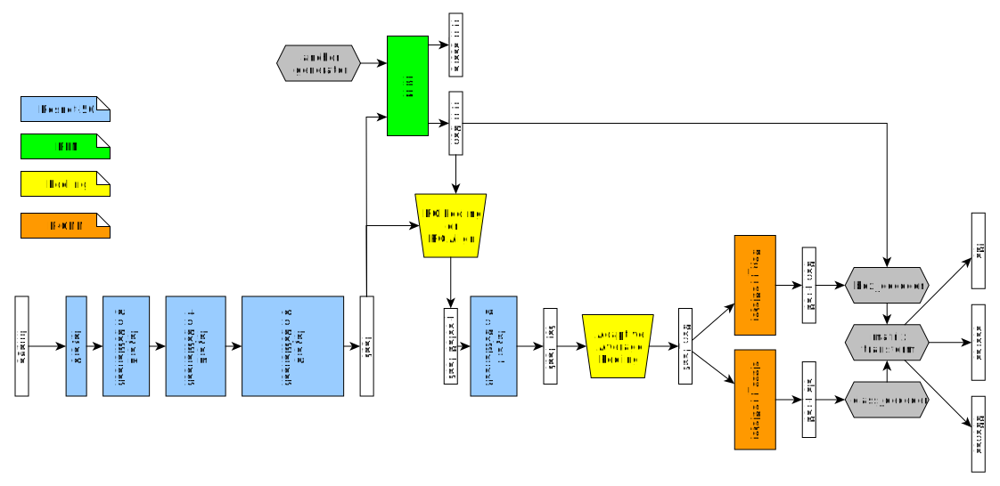
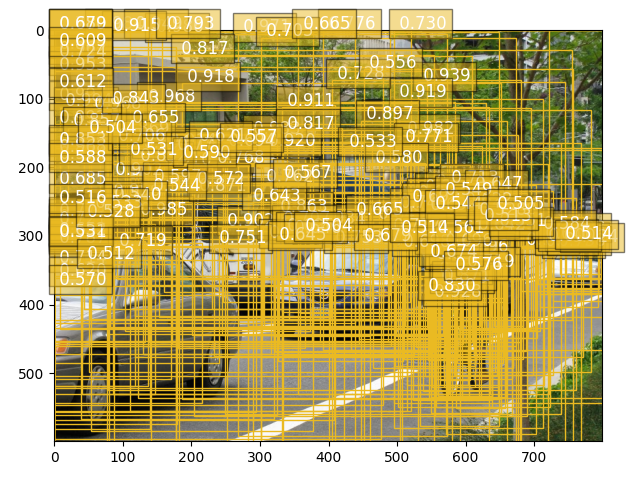
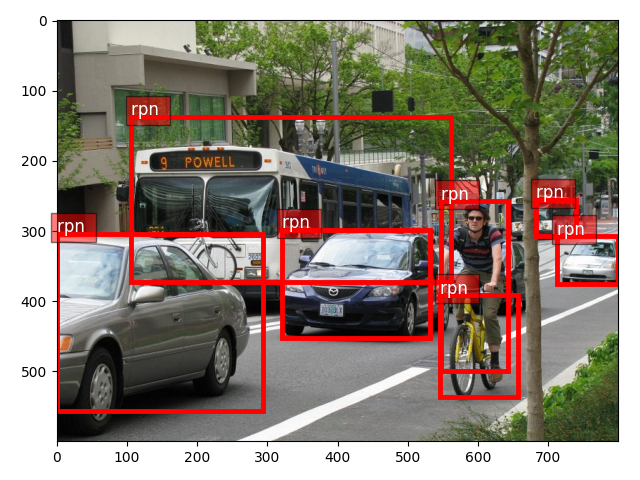
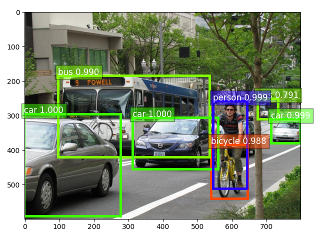

# Faster R-CNN Notes

Gilbert François Duivesteijn


## About
This document describes the implementation and feed forward of the Faster R-CNN network, using the implementation of *gluon-cv* version 0.7.0. We will use the image below to detect cars, bikes, busses and persons.

|  |
| :----------------------------------------------------------: |
|                         Input image                          |


## Feature extractor
For this example, we use a ResNet-50 v1 with bottlenecks as backbone feature extractor. The complete architecture is shown in the figure below:



| Variable name | shape             |
| ------------- | ----------------- |
| image         | (N, 3, 600, 800)  |
| feat          | (N, 1024, 38, 50) |
| rpn_box       | (N, ...)          |
| Pooled_feat   | (N, 1024, 14, 14) |
| top_feat      | (N, 2048, 7, 7)   |
| Box_feat      | (N, 2048, 1, 1)   |
| Box_pred      | (...)             |
| Cls_pred      | (...)             |
| ids           | (6000, 1)         |
| scores        | (6000, 1)         |
| bboxes        | (6000, 4)         |


|    |
| :------------------------------------------: |
| *feat* , (N x 1024 x 38 x 50) filter outputs |


## RPN

Region proposal network takes a matrix with zeros of the shape of the original input image and the feature map, given by the feature extractor. The zeros matrix is used to create valid anchor boxes. The RPN will predict for every anchor box if the box contains an object (class = 1) or background (class = 0).

```
>>> self.rpn
RPN(
  (anchor_generator): RPNAnchorGenerator(
  
  )
  (conv1): HybridSequential(
    (0): Conv2D(1024 -> 1024, kernel_size=(3, 3), stride=(1, 1), padding=(1, 1))
    (1): Activation(relu)
  )
  (score): Conv2D(1024 -> 15, kernel_size=(1, 1), stride=(1, 1))
  (loc): Conv2D(1024 -> 60, kernel_size=(1, 1), stride=(1, 1))
  (region_proposer): RPNProposal(
    (_box_to_center): BBoxCornerToCenter(
    
    )
    (_box_decoder): NormalizedBoxCenterDecoder(
      (corner_to_center): BBoxCornerToCenter(
      
      )
    )
    (_clipper): BBoxClipToImage(
    
    )
  )
)
```
```
>>> self.rpn.summary(F.zeros_like(x), feat)
--------------------------------------------------------------------------------
        Layer (type)                                Output Shape         Param #
================================================================================
               Input         (1, 3, 600, 800), (1, 1024, 38, 50)               0
RPNAnchorGenerator-1                               (1, 28500, 4)          983040
            Conv2D-2                           (1, 1024, 38, 50)         9438208
        Activation-3                           (1, 1024, 38, 50)               0
            Conv2D-4                             (1, 15, 38, 50)           15375
            Conv2D-5                             (1, 60, 38, 50)           61500
NormalizedBoxCenterDecoder-6                       (1, 28500, 4)               0
   BBoxClipToImage-7                               (1, 28500, 4)               0
       RPNProposal-8                               (1, 28500, 5)               0
               RPN-9                    (1, 300, 1), (1, 300, 4)               0
================================================================================
Parameters in forward computation graph, duplicate included
   Total params: 10498123
   Trainable params: 9515083
   Non-trainable params: 983040
Shared params in forward computation graph: 0
Unique parameters in model: 10498123
--------------------------------------------------------------------------------

```


|              |
| :----------------------------------------------------------: |
| Output of the region proposal network, containing 300 proposals. (In this figure, only boxes with $rpn\_score \geq 0.9$ are plotted for clarity.) |

Hidden in these proposals are the boxes that will contain the objects of interest. Note:

- The RPN does not classify what object it sees
- The anchor bounding boxes are approximate and not exact aligned around the object. 

|       |
| :----------------------------------------------------------: |
| The boxes from the RPN that will be selected eventually after R-CNN inference |


```

```

## Class and box predictors

```
>>> self.class_predictor
Dense(2048 -> 21, linear)
```
```
>>> self.class_predictor.summary(box_feat)
--------------------------------------------------------------------------------
        Layer (type)                                Output Shape         Param #
================================================================================
               Input                           (300, 2048, 1, 1)               0
             Dense-1                                   (300, 21)           43029
================================================================================
Parameters in forward computation graph, duplicate included
   Total params: 43029
   Trainable params: 43029
   Non-trainable params: 0
Shared params in forward computation graph: 0
Unique parameters in model: 43029
--------------------------------------------------------------------------------

```


```
>>> self.box_predictor
Dense(2048 -> 80, linear)
```
```
>>> self.box_predictor.summary(box_feat)
--------------------------------------------------------------------------------
        Layer (type)                                Output Shape         Param #
================================================================================
               Input                           (300, 2048, 1, 1)               0
             Dense-1                                   (300, 80)          163920
================================================================================
Parameters in forward computation graph, duplicate included
   Total params: 163920
   Trainable params: 163920
   Non-trainable params: 0
Shared params in forward computation graph: 0
Unique parameters in model: 163920
--------------------------------------------------------------------------------
```

|  |
| :------------------------------------------: |
|               Final prediction               |